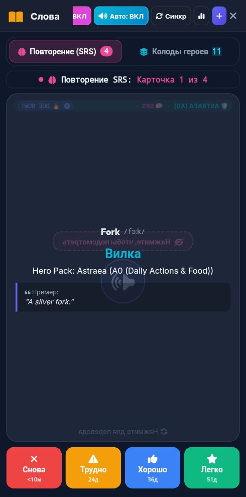

# 🐞 Отчёт о проблеме: report_2026-09-17_20-25-36____Vocab___Flashcards

- **📅 Дата и время:** 17.09.2026, 21:25:35
- **🕹️ Режим / Экран:** 📚 Vocab & Flashcards
- **👤 Активный герой:** Valerius Lvl 100
- **🏷️ Категория:** 🐛 Баг / Ошибка
- **📐 Разрешение экрана:** 392x791

---

## 📝 Описание пользователя
> На этой карточке нажимала "снова", она оказалась в конце очереди, но таймеры у трудно, хорошо и легко не сбросились

---

## 📸 Скриншот экрана

---

## 🛠️ Дополнительная информация
- **URL:** `https://englishpulse.share.zrok.io/index.html`
- **Контекст:** Сценарий: Tech Job Interview
- **User Agent:** `Mozilla/5.0 (Linux; Android 10; K) AppleWebKit/537.36 (KHTML, like Gecko) Chrome/152.0.0.0 Mobile Safari/537.36`

### 📋 Последние логи / ошибки браузера:
_Логов ошибок консоли нет_
