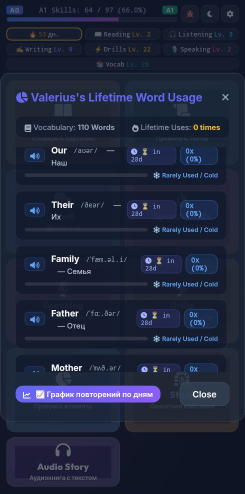

# 🐞 Отчёт о проблеме: report_2026-09-17_21-54-56____Главный_экран__Hero_Showcas

- **📅 Дата и время:** 17.09.2026, 22:54:55
- **🕹️ Режим / Экран:** 🏰 Главный экран (Hero Showcase Hub)
- **👤 Активный герой:** Valerius Lvl 100
- **🏷️ Категория:** 🎨 Вёрстка / Визуал
- **📐 Разрешение экрана:** 392x791

---

## 📝 Описание пользователя
> С телефона статистика по словам открывает только валериуса, на остальных героев не выйти

---

## 📸 Скриншот экрана


---

## 🛠️ Дополнительная информация
- **URL:** `https://englishpulse.share.zrok.io/index.html`
- **Контекст:** Сценарий: Tech Job Interview
- **User Agent:** `Mozilla/5.0 (Linux; Android 10; K) AppleWebKit/537.36 (KHTML, like Gecko) Chrome/152.0.0.0 Mobile Safari/537.36`

### 📋 Последние логи / ошибки браузера:
```json
[
  {
    "type": "warn",
    "time": "21:28:18",
    "msg": "[Audiobook Player] Audio play error: {}"
  },
  {
    "type": "warn",
    "time": "21:28:19",
    "msg": "[Audiobook Player] Audio play error: {}"
  },
  {
    "type": "warn",
    "time": "21:28:23",
    "msg": "[Audiobook Player] Audio play error: {}"
  },
  {
    "type": "warn",
    "time": "21:33:48",
    "msg": "[Audiobook Player] Audio play error: {}"
  },
  {
    "type": "warn",
    "time": "21:52:43",
    "msg": "[Audiobook Player] Audio play error: {}"
  }
]
```
