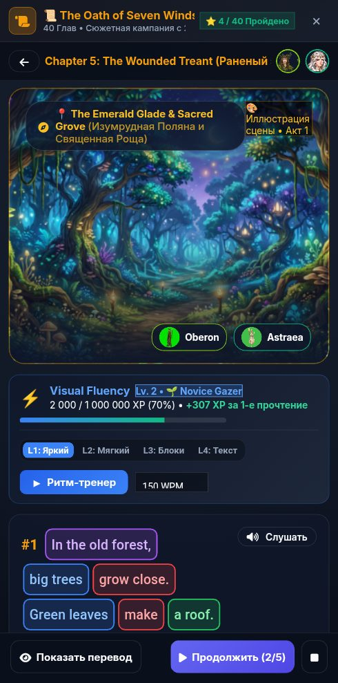

# 🐞 Отчёт о проблеме: report_2026-09-18_23-00-19____Сюжетная_Кампания

- **📅 Дата и время:** 19.09.2026, 00:00:20
- **🕹️ Режим / Экран:** ⚔️ Сюжетная Кампания
- **👤 Активный герой:** Valerius Lvl 100
- **🏷️ Категория:** 🎨 Вёрстка / Визуал
- **📐 Разрешение экрана:** 392x791

---

## 📝 Описание пользователя
> Получаетая, копка "слушать" не дает тексту распределиться по всему экрану, пространство под кнопкой всегда пустое. 
> Если на неё нажать, то кнопка будет называться "пауза", занимать меньше места, а текст займет больше места 
> Надо, чтобы текст распределился по всему экрану телефона независимо от этой кнопки

---

## 📸 Скриншот экрана

---

## 🛠️ Дополнительная информация
- **URL:** `https://englishpulse.share.zrok.io/index.html`
- **Контекст:** Сценарий: Tech Job Interview
- **User Agent:** `Mozilla/5.0 (Linux; Android 10; K) AppleWebKit/537.36 (KHTML, like Gecko) Chrome/152.0.0.0 Mobile Safari/537.36`

### 📋 Последние логи / ошибки браузера:
_Логов ошибок консоли нет_
