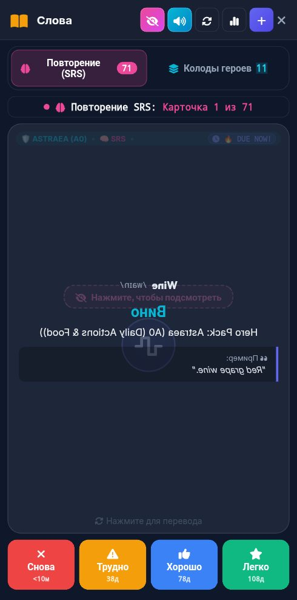

# 🐞 Отчёт о проблеме: report_2026-09-20_21-14-00____Vocab___Flashcards

- **📅 Дата и время:** 20.09.2026, 22:13:01
- **🕹️ Режим / Экран:** 📚 Vocab & Flashcards
- **👤 Активный герой:** Valerius Lvl 100
- **🏷️ Категория:** 🔊 Озвучка / Звук
- **📐 Разрешение экрана:** 392x791

---

## 📝 Описание пользователя
> Очень долго прогружается озвучка

---

## 📸 Скриншот экрана


---

## 🛠️ Дополнительная информация
- **URL:** `https://englishpulse.share.zrok.io/index.html`
- **Контекст:** Сценарий: Tech Job Interview
- **User Agent:** `Mozilla/5.0 (Linux; Android 10; K) AppleWebKit/537.36 (KHTML, like Gecko) Chrome/152.0.0.0 Mobile Safari/537.36`

### 📋 Последние логи / ошибки браузера:
```json
[
  {
    "type": "error",
    "time": "22:12:53",
    "msg": "[Submit Report Error] {}"
  }
]
```
