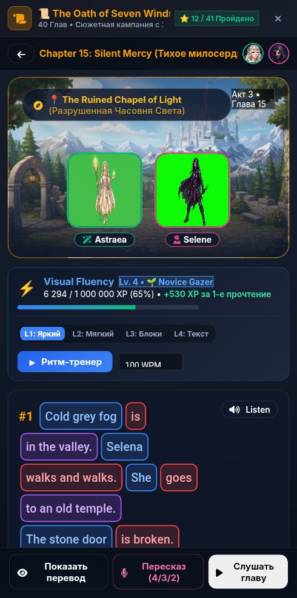

# 🐞 Отчёт о проблеме: report_2026-09-21_21-55-08____Сюжетная_Кампания

- **📅 Дата и время:** 21.09.2026, 22:55:07
- **🕹️ Режим / Экран:** ⚔️ Сюжетная Кампания
- **👤 Активный герой:** Valerius Lvl 100
- **🏷️ Категория:** 🎨 Вёрстка / Визуал
- **📐 Разрешение экрана:** 392x791

---

## 📝 Описание пользователя
> Сложно поставить на паузу ритм тренер , если он уже далеко ушёл, так как кнопка в шапке

---

## 📸 Скриншот экрана

---

## 🛠️ Дополнительная информация
- **URL:** `https://englishpulse.share.zrok.io/index.html`
- **Контекст:** Сценарий: Tech Job Interview
- **User Agent:** `Mozilla/5.0 (Linux; Android 10; K) AppleWebKit/537.36 (KHTML, like Gecko) Chrome/152.0.0.0 Mobile Safari/537.36`

### 📋 Последние логи / ошибки браузера:
_Логов ошибок консоли нет_
