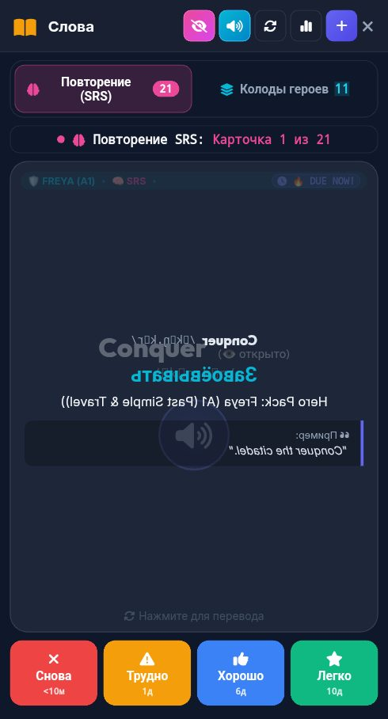

# 🐞 Отчёт о проблеме: report_2026-09-28_20-42-40____Vocab___Flashcards

- **📅 Дата и время:** 28.09.2026, 21:42:40
- **🕹️ Режим / Экран:** 📚 Vocab & Flashcards
- **👤 Активный герой:** Valerius Lvl 100
- **🏷️ Категория:** 🐛 Баг / Ошибка
- **📐 Разрешение экрана:** 392x512

---

## 📝 Описание пользователя
> Квадраты в транскрипции

---

## 📸 Скриншот экрана

---

## 🛠️ Дополнительная информация
- **URL:** `http://10.232.21.139:3000/`
- **Контекст:** Сценарий: Tech Job Interview
- **User Agent:** `Mozilla/5.0 (Linux; Android 12; Redmi Note 10S Build/SP1A.210812.016) AppleWebKit/537.36 (KHTML, like Gecko) Chrome/135.0.7049.79 Mobile Safari/537.36 XiaoMi/MiuiBrowser/14.62.1-gn`

### 📋 Последние логи / ошибки браузера:
_Логов ошибок консоли нет_
