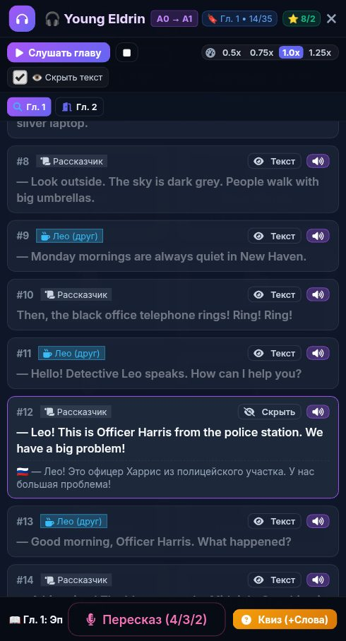

# 🐞 Отчёт о проблеме: report_2026-10-02_23-09-37____Аудиокнига

- **📅 Дата и время:** 03.10.2026, 00:09:38
- **🕹️ Режим / Экран:** 🎧 Аудиокнига
- **👤 Активный герой:** Valerius Lvl 100
- **🏷️ Категория:** 🐛 Баг / Ошибка
- **📐 Разрешение экрана:** 392x512

---

## 📝 Описание пользователя
> Офицер Харрис обозначен как рассказчик почему-то

---

## 📸 Скриншот экрана

---

## 🛠️ Дополнительная информация
- **URL:** `https://englishpulserpg.share.zrok.io/`
- **Контекст:** Сценарий: Tech Job Interview
- **User Agent:** `Mozilla/5.0 (Linux; Android 12; Redmi Note 10S Build/SP1A.210812.016) AppleWebKit/537.36 (KHTML, like Gecko) Chrome/135.0.7049.79 Mobile Safari/537.36 XiaoMi/MiuiBrowser/14.62.1-gn`

### 📋 Последние логи / ошибки браузера:
_Логов ошибок консоли нет_

---

## ✅ Статус исправления
- **Статус:** Решено
- **Решение:** Добавлены бейджи персонажей детективной истории (`harris`, `mia`, `blackwood`, `arthur`, `claire`, `victor`, `jenkins`, `julian`, `elena`) в `app.js` и приоритет `sent.voice` при воспроизведении аудиокниги.

