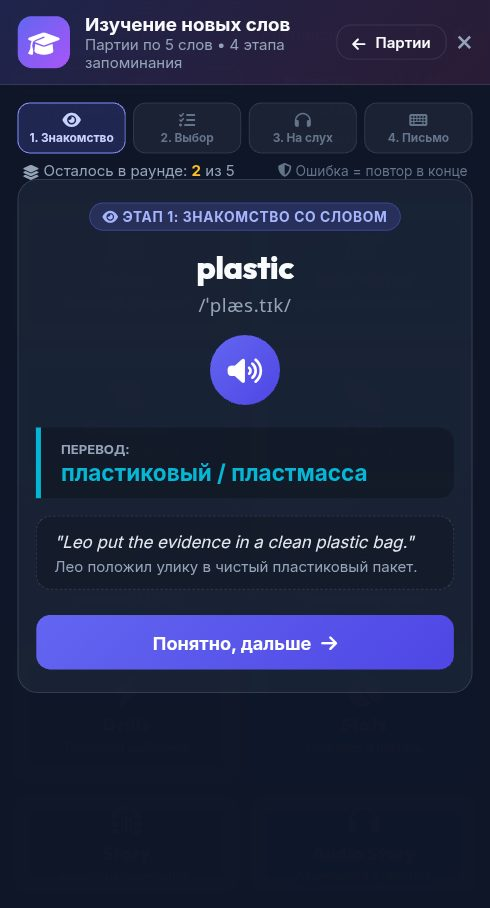

# 🐞 Отчёт о проблеме: report_2026-10-04_00-04-17____Главный_экран__Hero_Showcas

- **📅 Дата и время:** 04.10.2026, 01:04:17
- **🕹️ Режим / Экран:** 🏰 Главный экран (Hero Showcase Hub)
- **👤 Активный герой:** Valerius Lvl 100
- **🏷️ Категория:** 🔊 Озвучка / Звук
- **📐 Разрешение экрана:** 392x727

---

## 📝 Описание пользователя
> Нет пред записанной озвучки

---

## 📸 Скриншот экрана

---

## 🛠️ Дополнительная информация
- **URL:** `https://englishpulserpg.share.zrok.io/`
- **Контекст:** Сценарий: Tech Job Interview
- **User Agent:** `Mozilla/5.0 (Linux; Android 12; Redmi Note 10S Build/SP1A.210812.016) AppleWebKit/537.36 (KHTML, like Gecko) Chrome/135.0.7049.79 Mobile Safari/537.36 XiaoMi/MiuiBrowser/14.62.1-gn`

### 📋 Последние логи / ошибки браузера:
_Логов ошибок консоли нет_

---

## ✅ Статус исправления
- **Статус:** Решено
- **Решение:** Сгенерированы офлайн WAV-файлы для слова `plastic` и всех новых/недостающих слов (`mud`, `loud`, `plastic`, `size`, `deliver`, `boil`, `pot`, `stove`, `helmet`, `bark`, `happen`, `wet`, `quickly`, `put`, `work`, `refactor`, `deprecate`, `idempotent`). Обновлены рабочие модели Gemini TTS в `server.js` (`gemini-3.8-flash-tts`), манифест аудио обновлен.

