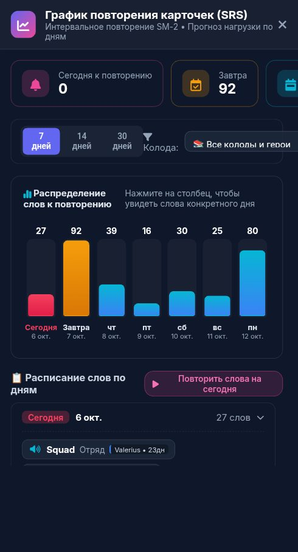

# 🐞 Отчёт о проблеме: report_2026-10-05_23-54-52____SRS_Forecast

- **📅 Дата и время:** 06.10.2026, 00:54:53
- **🕹️ Режим / Экран:** 📈 SRS Forecast
- **👤 Активный герой:** Valerius Lvl 100
- **🏷️ Категория:** 🐛 Баг / Ошибка
- **📐 Разрешение экрана:** 392x512

---

## 📝 Описание пользователя
> При открытии графика повторения, окно оказывается не на переднем плане, а сзади текущего открытого окна

---

## 📸 Скриншот экрана


---

## 🛠️ Дополнительная информация
- **URL:** `https://englishpulserpg.share.zrok.io/`
- **Контекст:** Сценарий: Tech Job Interview
- **User Agent:** `Mozilla/5.0 (Linux; Android 12; Redmi Note 10S Build/SP1A.210812.016) AppleWebKit/537.36 (KHTML, like Gecko) Chrome/135.0.7049.79 Mobile Safari/537.36 XiaoMi/MiuiBrowser/14.62.1-gn`

### 📋 Последние логи / ошибки браузера:
```json
[
  {
    "type": "warn",
    "time": "00:50:13",
    "msg": "[Gemini TTS Endpoint 502] All Gemini TTS models failed"
  },
  {
    "type": "warn",
    "time": "00:52:38",
    "msg": "[Gemini TTS Endpoint 502] All Gemini TTS models failed"
  }
]
```

---

## ✅ Статус исправления
- **Статус:** Решено
- **Решение:** Увеличен z-index для `#modal-srs-forecast` до `100005 !important` (в `index.html` и `styles.css`), благодаря чему окно графика повторений всегда отображается поверх любого открытого модального окна (включая окно словаря с `z-index: 99999`).

